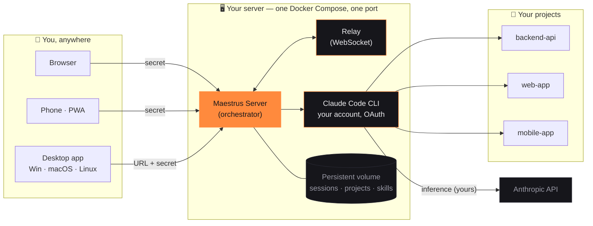

<div align="center">


# Maestrus Self-Host

**The conductor for your AI coding agents — on your own server.**

Drive all your projects with Claude, from any device, by text or voice —
with sessions that **never die when your PC sleeps**.

[](LICENSE)
[](#-quick-start)
[](#-connect-from-anywhere)
[](#-your-ai-your-account)



*One command. One port. Your server. Your Claude account.*

</div>

---

## 😤 The pain

If you code with AI agents, you know these:

1. **Your AI lives in a terminal.** Close the laptop — work stops. Leave the house — work stops.
2. **Mirrored "remote control" dies with your PC.** Machine sleeps → session gone → you reconnect → *new session, orphaned work*. (Reddit is full of these stories.)
3. **One project at a time.** You juggle folders, windows and terminals. There's no control room for everything you're building.
4. **Cloud AI services double-charge you** — your subscription *plus* their token markup.

## 🎼 The fix

**Maestrus is the maestro.** A single self-hosted server that runs Claude Code
inside *each of your projects*, 24/7, and lets you conduct them all from one
chat — browser, phone or desktop app. Sessions live on disk, so nothing is ever
lost. And the AI is **your** Claude account, talking straight to Anthropic. No
middleman, no markup, no monthly fee.

```
"Ship the endpoint on the backend, adjust the frontend and update the mobile app."
        └── one sentence → three projects → three agents working in parallel
```

---

## ⚡ Quick start

```bash
git clone https://github.com/joaoventuri/maestrus-selfhost
cd maestrus-selfhost
cp .env.example .env        # set a strong SELFHOST_SECRET  (openssl rand -hex 32)
docker compose up -d
```

That's it. **One port (default 8090) serves everything:**

| What | Where |
|---|---|
| 🖥️ Web app | `http://YOUR_IP:8090` |
| 📱 Phone (installable PWA) | `http://YOUR_IP:8090/app` |
| 🔌 Realtime relay (built-in) | same port, proxied at `/relay` |

On first access, enter your `SELFHOST_SECRET`, then **connect your Claude
account** (official OAuth — approve in browser, paste the code). Start conducting.

> 💡 Put any HTTPS proxy (Caddy, Traefik, nginx) in front of port 8090 and use
> your own domain — web, PWA and relay all flow through that single port.

---

## 🚀 What you get

| | |
|---|---|
| 🎼 **The Maestro** | Orchestrate *multiple projects* from one conversation — each with its own context, rules and agent. `/team`, `/ask`, `/parallel`. |
| ♾️ **Sessions that never die** | History lives on disk. Server restarts? Same conversation resumes. This is the whole point. |
| 👥 **Multi-account Claude** | Register more than one Claude subscription and **switch mid-conversation** when one hits its weekly limit — without losing the thread. |
| ⚡ **Claude Powers** | Skills, subagents, slash commands, MCP connectors and global rules — everything Claude can use, managed in one screen. |
| 🎙️ **Jarvis voice mode** | Talk to your projects, hands-free, with spoken replies. (Optional realtime voice via your own OpenAI key.) |
| 📋 **24/7 Kanban** | Queue 10 tasks at night, wake up with them done. The server works while you sleep. |
| 🧭 **Real usage meter** | `/usage` shows your **official** Claude quota (5-hour session, weekly, per-model) — live from Anthropic, not an estimate. |
| 📎 **Attachments that just work** | Send a file from your phone — it lands physically on the server where the agent runs. |
| 🌐 **Every screen** | Web, installable PWA, and native desktop apps (Windows `.exe`, macOS `.dmg`, Linux `.AppImage`) that connect via *"Connect to my server"*. |
| 🌍 **Trilingual UI** | English · Português · Español. Light & dark themes. |

## 🔑 Your AI, your account

Maestrus never resells tokens and has **zero** AI billing:

- **Claude CLI engine** — log in with your own Claude subscription (Pro/Max) via
  official OAuth. Your limits, your privacy, your relationship with Anthropic.
- **Claude API engine** — prefer pay-as-you-go? Use your own Anthropic API key.

Either way, inference goes **directly to Anthropic** from your server.

---

## 🧩 How it works



**Auth model:** one `SELFHOST_SECRET` (from your `.env`) is the single
credential. Clients prove it once, receive short-lived signed tokens (HS256),
and talk to the relay through the same port. No accounts, no external services.

## 🛠️ Tech stack

| Layer | Tech |
|---|---|
| Server | **Node.js 22** (headless orchestrator) + **Claude Code CLI** |
| Realtime | **WebSocket relay** (JWT HS256, outbound-only clients — no open ports on your devices) |
| Web / PWA | **React 18 + Vite + TypeScript**, installable PWA with voice |
| Desktop | **Electron** (Windows / macOS / Linux), bundled Node + Git + Claude CLI |
| Voice | Web Speech API (phone) · **Whisper** local (desktop) · optional OpenAI realtime (BYOK) |
| Packaging | **Docker Compose** — two images (`maestrus-server`, `maestrus-relay`), one volume, one port |

## 🔄 Update & backup

```bash
# update
docker compose pull && docker compose up -d

# backup everything (projects, sessions, Claude credentials, skills)
docker run --rm -v maestrus-data:/data -v "$PWD":/backup alpine \
  tar czf /backup/maestrus-backup.tgz -C /data .
```

## 📦 Requirements

- Linux x86_64 host (or Docker Desktop on Windows/macOS) · 2 GB RAM min, 4 GB recommended
- Docker + Docker Compose

## 🖥️ Connect from anywhere

- **Browser / PWA:** open your server URL, enter the secret. Done.
- **Desktop apps:** grab the installer from [Releases](../../releases), open
  **Remote Access → Connect to my server**, paste URL + secret. It reconnects
  automatically on every launch.

## 📜 License

**Business Source License 1.1** — free to use, modify and run, including
commercially inside your organization. You may **not** offer it to third
parties as a competing hosted service. Each release converts to **Apache 2.0**
four years after publication. See [LICENSE](LICENSE).

---

<div align="center">

**Maestrus** · <sub>your projects, conducted.</sub>

<sub>Found it useful? A ⭐ helps other builders find it.</sub>

</div>
