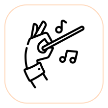
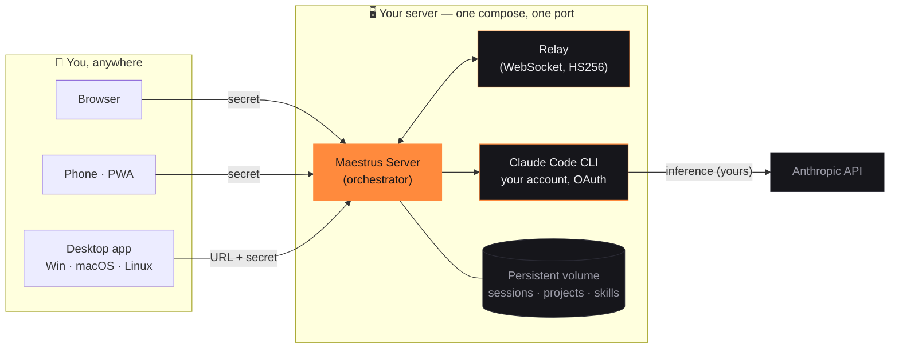

<div align="center">



# Maestrus

### Your projects, conducted.

**One AI conductor. All your codebases. Working 24/7 — even while you sleep.**

[](LICENSE)
[](#-quick-start)
[](#-desktop--mobile-apps)
[](#-your-ai-your-account-your-rules)

[**Quick start**](#-quick-start) · [**What it does**](#-what-maestrus-actually-does) · [**Apps**](#-desktop--mobile-apps) · [**Cloud vs self-host**](#%EF%B8%8F-self-host-or-maestrus-cloud) · [**FAQ**](#-faq)

</div>

---

## The moment that made this exist

You know it. You're driving Claude Code from your phone through some mirrored
remote-control app. It's 11pm, the agent is deep into a refactor. Your laptop
lid closes. **Session dead.** You reconnect — new conversation, zero context,
the evening's work orphaned in a `.jsonl` you'll never resume.

Maestrus was built out of that exact rage. The fix isn't a better mirror — it's
**moving the conductor to a server that never sleeps.**

```text
you (phone, browser, desktop — anywhere)
        │
        ▼
┌──────────────────────────── your server ────────────────────────────┐
│   🎼 MAESTRUS                                                        │
│   "Ship the API on the backend, wire it in the web app,             │
│    and update the mobile client."                                   │
│         │                    │                     │                 │
│         ▼                    ▼                     ▼                 │
│   backend-api           web-app               mobile-app            │
│   Claude session        Claude session        Claude session        │
│   (never dies)          (never dies)          (never dies)          │
└──────────────────────────────────────────────────────────────────────┘
```

One sentence. Three projects. Three agents working in parallel. And every one
of those sessions lives **on disk, on your server** — close every device you
own and the work continues.

---

## ⚡ Quick start

Sixty seconds, one port, zero accounts:

```bash
git clone https://github.com/joaoventuri/maestrus
cd maestrus
cp .env.example .env        # set a strong SELFHOST_SECRET  (openssl rand -hex 32)
docker compose up -d
```

| Surface | Where |
|---|---|
| 🖥️ Web app | `http://YOUR_IP:8090` |
| 📱 Phone — installable PWA | `http://YOUR_IP:8090/app` |
| 🔌 Realtime relay | same port, built in, proxied at `/relay` |

Open the URL, enter your secret, connect your Claude account (official
Anthropic OAuth — approve in the browser, paste the code). **Start conducting.**

> 💡 Put Caddy/Traefik/nginx in front of port 8090 for HTTPS on your own
> domain. Web, PWA and relay all flow through that single port.

---

## 🎼 What Maestrus actually does

### The Maestro — one conversation that conducts everything
The heart of Maestrus is a special conversation that sees **all your
projects**. Talk to it like a tech lead: it reads your intent, picks the right
project (or several), dispatches self-contained prompts via MCP, and keeps
going without blocking — each project's answer lands in that project's own
chat. Fire-and-forget for parallel work, or chained when step B needs step A's
output. It can also queue work on the Kanban and collect results later.

### Forks — parallel conversations inside one project
Right-click a project → **Fork conversation**. You get a new Claude session
that *inherits the full context* of the original (real `--fork-session`
branching, not a copy-paste). Rename it ("NGINX config", "payments bug"),
fork a fork, delete one without touching the rest. The project becomes an
accordion of live conversations, each with its own typing indicator — and the
project's **main conversation can conduct its own forks by title**:

> *"Send the migration plan to the payments-bug fork and have the NGINX fork
> validate the proxy config."*

### Sessions that refuse to die
Every conversation is a Claude Code session persisted on your server's disk.
Server reboots? `docker compose up -d` and the same conversation resumes —
mid-thought. This isn't a feature, it's the founding principle.

### ⚡ Claude Powers — everything Claude can use, one screen
Skills, subagents, slash commands, MCP connectors and global rules (CLAUDE.md)
— pulled from your Claude account as the source of truth, managed from the
Maestrus UI. Add an MCP server once; every project and every fork can use it.

### 📋 A Kanban that works the night shift
Queue ten tasks before bed. The built-in worker runs them one at a time per
project — with optional **goal loops** ("implement and iterate until tests
pass, max 8 rounds") — and stores every result for morning review.

### 🎙️ Jarvis mode
Talk to your projects. Speech-to-text in, project execution, spoken answer
out, mic politely suspended while the maestro is thinking. Hands on the
steering wheel, agents on the codebase.

### 👥 Multi-account Claude — the weekly-limit escape hatch
Register more than one Claude subscription and **switch accounts
mid-conversation, without losing the thread**. When one account hits its
limit, flip to the next and keep conducting — from the desktop or from a
remote client.

### 🧭 A `/usage` you can trust
No estimates: Maestrus reads your **official Anthropic quota** — 5-hour
session window, weekly cap, per-model breakdown — live from the same endpoint
Claude Code uses.

### 📎 Attachments that actually arrive
Drop a file in the chat from your phone. It lands **physically on the
server**, where the agent runs — no "file not accessible" dead ends.

### 🔐 Private repos, first-class
Create a project from any GitHub URL. Private repo? Paste an access token
once — it's stored as a git credential on your server, so the clone works
*and every future agent `git pull`/`push` works too*.

### 🌍 The small big things
Trilingual UI (English · Português · Español) · light & dark themes ·
context-usage ring with `/compact` that keeps your history continuous ·
per-project model/thinking/permission settings · project sharing.

---

## 📥 Desktop & mobile apps

The same native app powers Maestrus Cloud and your self-hosted server — the
links below always point at the newest build:

<div align="center">

[](https://maestrus.cloud/download/win)
[](https://maestrus.cloud/download/mac)
[](https://maestrus.cloud/download/linux)

<sub>Node, Git and the Claude CLI come bundled — install and go. On your phone,
open <code>http://YOUR_SERVER:8090/app</code> → "Add to Home Screen".</sub>

</div>

Desktop → **Remote Access → Connect to my server** → paste URL + secret.
It reconnects automatically on every launch. The desktop also works fully
standalone (local projects, no server at all) — free forever.

---

## 🔑 Your AI, your account, your rules

Maestrus **never resells tokens and has zero AI billing**:

- **Claude CLI engine** — sign in with your own Claude subscription (Pro/Max)
  via official OAuth. Your limits, your privacy, your relationship with
  Anthropic.
- **Claude API engine** — prefer pay-as-you-go? Bring your own Anthropic API
  key.

Either way, inference goes **straight from your server to Anthropic**. No
middleman, no markup, no monthly AI fee.

---

## 🧩 How it works



**Auth model:** one `SELFHOST_SECRET` is the single credential. Clients prove
it once, receive short-lived HS256 tokens, and talk to the relay through the
same port. Clients only make **outbound** connections — no ports to open on
your laptop or phone. No accounts, no external services, no telemetry.

---

## ☁️ Self-host or Maestrus Cloud?

Same product, same features — the only question is who runs the server.

| | **Self-Host** (this repo, free) | **[Maestrus Cloud](https://maestrus.cloud)** |
|---|---|---|
| The full Maestrus — maestro, forks, powers, kanban, voice | ✅ | ✅ |
| Setup | Docker, one command | **40 seconds**, zero setup |
| URL + HTTPS | your domain, your proxy | `you.maestrus.cloud`, automatic |
| Updates / backups / monitoring | `docker compose pull` | managed for you |
| Access | your secret, your network | account login, anywhere |
| Price | free (BSL 1.1) | **30 days free, no card** → from $12/mo |

The honest pitch: if you enjoy running servers, self-host and pay nothing,
ever. If you'd rather never think about it, [Cloud](https://maestrus.cloud)
is the same thing with the ops handled.

---

## ❓ FAQ

<details><summary><b>Do I need a Claude subscription?</b></summary>
Yes — Maestrus conducts Claude Code, it doesn't replace it. A Claude Pro/Max
subscription (or an Anthropic API key) plugs in via official OAuth. Your usage
is between you and Anthropic.</details>

<details><summary><b>Where does my code live?</b></summary>
On your server, in a named Docker volume: projects, sessions, skills, git
credentials. Back it all up with one <code>tar</code> (below). Nothing is
synced anywhere.</details>

<details><summary><b>Is it multi-user?</b></summary>
One secret = one workspace, built for a single owner across all their devices.
Anyone with the secret shares the workspace — team accounts with permissions
are on the roadmap.</details>

<details><summary><b>What if my server reboots?</b></summary>
Containers restart (<code>restart: unless-stopped</code>), sessions resume
from disk. That's the whole point.</details>

<details><summary><b>Can the desktop app work without a server?</b></summary>
Yes — it's a complete local Maestrus (projects, maestro, voice) on its own.
The server adds the 24/7 + any-device layer.</details>

---

## 🛠️ Operations

```bash
# update to the latest images
docker compose pull && docker compose up -d

# full backup (projects, sessions, Claude credentials, skills)
docker run --rm -v maestrus-data:/data -v "$PWD":/backup alpine \
  tar czf /backup/maestrus-backup.tgz -C /data .
```

**Requirements:** Linux x86_64 host (or Docker Desktop) · 2 GB RAM min, 4 GB
recommended · Docker + Compose.

## 📂 Build from source

This repo ships the real source — server, relay, shared backend, all clients:

```
maestrus-server/   Headless orchestrator (the Docker image entrypoint)
relay/             WebSocket relay (HS256 tokens, host/client rooms)
electron/          Shared backend: Claude spawn/stream, projects, forks,
                   sessions, skills, MCP, multi-account, self-host mode
renderer/          React UI — web app, installable PWA, desktop windows
```

```bash
npm install
npm run build:web && npm run build:mobile
docker build -f maestrus-server/Dockerfile -t maestrus-server:local .
docker build -f relay/Dockerfile -t maestrus-relay:local relay
# desktop apps: npm run build:mac | build:win | build:linux
```

## 📜 License

**Business Source License 1.1** — free to use, modify and run, including
commercially inside your organization. You may not offer it to third parties
as a competing hosted service. Each release converts to **Apache 2.0** four
years after publication. See [LICENSE](LICENSE).

---

<div align="center">

**Maestrus** · <sub>your projects, conducted.</sub>

<sub>If this saved your 11pm refactor, a ⭐ helps other builders find it.</sub>

<sub>Don't want to run a server? [**Maestrus Cloud**](https://maestrus.cloud) — your instance in 40 seconds, 30 days free, no card.</sub>

</div>
