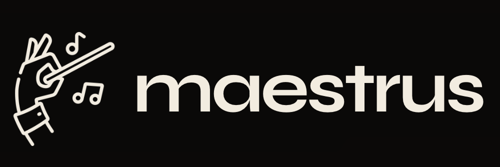
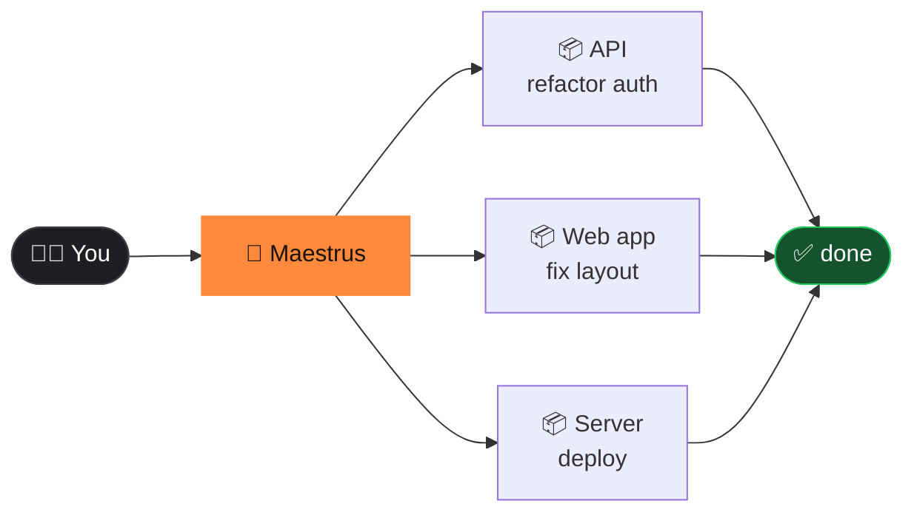
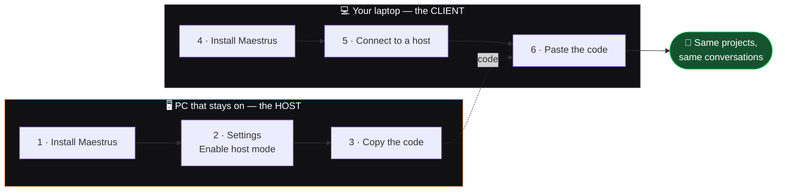
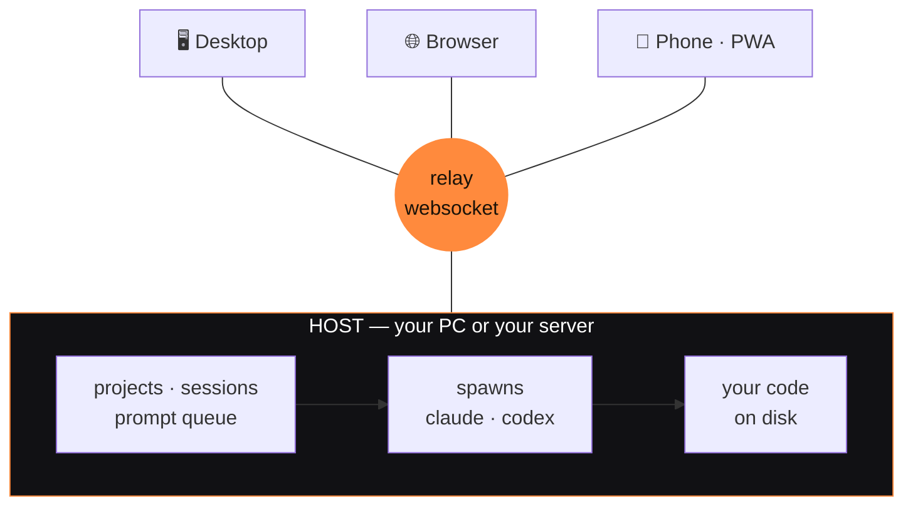
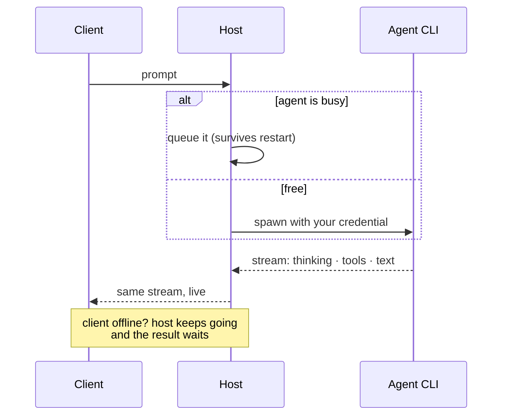

<div align="center">



<br/><br/>

### The maestro of your AI coding agents

**One conductor for every codebase you own.**<br/>
Runs on your machines, with your accounts.<br/>
No cloud account, no limits, nothing phones home.

<br/>

[](https://maestrus.cloud/downloads/maestrus-win-0.5.0.exe)
[](https://maestrus.cloud/downloads/maestrus-mac-0.5.0.dmg)
[](#-build-from-source)

<sub>Latest **v0.4.56** · [all releases](https://github.com/joaoventuri/maestrus/releases) · Apache-2.0 · no telemetry</sub>

<br/>


</div>

<br/>

---

<br/>

## 🎼 &nbsp;Why

Claude Code and Codex are brilliant at **one project, one terminal, one machine**.
Own five codebases and it falls apart: five terminals, five contexts in your head,
and everything stops the moment you close the laptop.

Maestrus sits **above** the agent. Each codebase becomes a *system* it can drive.
From one chat you dispatch work to many projects at once — and the work keeps
running when you walk away.

<br/>


```mermaid
flowchart LR
    You(["🧑‍💻 You"]) --> M["🎼 Maestrus"]
    M --> P1["📦 API<br/>refactor auth"]
    M --> P2["📦 Web app<br/>fix layout"]
    M --> P3["📦 Server<br/>deploy"]
    P1 --> D(["✅ done"])
    P2 --> D
    P3 --> D

    style M fill:#ff8a3d,stroke:#ff8a3d,color:#1a1208
    style You fill:#1f1f23,stroke:#3f3f46,color:#fff
    style D fill:#14532d,stroke:#22c55e,color:#fff
```

<br/>

---

<br/>

## ⚡ &nbsp;Pick your setup

Three ways to run it. **All of them work out of the box** — no account, no plan, no limits.

<br/>

<table>
<tr>
<th width="33%">🖥️ &nbsp;Just this machine</th>
<th width="33%">🏠 &nbsp;One PC as host</th>
<th width="33%">☁️ &nbsp;A server as host</th>
</tr>
<tr>
<td valign="top">

**Simplest.** Install and use.

Your projects, your agent, your machine.

<sub>Nothing else to configure.</sub>

</td>
<td valign="top">

**Most common.** Your desktop stays on and does the work; laptop and phone drive it.

<sub>Windows → Windows works exactly the same. No Linux required.</sub>

</td>
<td valign="top">

**Always on.** A server or VPS runs 24/7 and everyone connects by URL.

<sub>One `docker compose up`.</sub>

</td>
</tr>
</table>

<br/>

### 🏠 &nbsp;Windows host + Windows client, step by step

No terminal, no Linux, no Docker.


```mermaid
flowchart LR
    subgraph A ["🖥️ PC that stays on — the HOST"]
        A1["1 · Install Maestrus"] --> A2["2 · Settings<br/>Enable host mode"] --> A3["3 · Copy the code"]
    end
    subgraph B ["💻 Your laptop — the CLIENT"]
        B1["4 · Install Maestrus"] --> B2["5 · Connect to a host"] --> B3["6 · Paste the code"]
    end
    A3 -.->|code| B3
    B3 --> C(["🎉 Same projects,<br/>same conversations"])

    style A fill:#111114,stroke:#ff8a3d,color:#fff
    style B fill:#111114,stroke:#3f3f46,color:#fff
    style C fill:#14532d,stroke:#22c55e,color:#fff
```

Close the laptop and the host keeps working. Open your **phone** later, connect
the same way, and the conversation is right where you left it.

<br/>

---

<br/>

## ✨ &nbsp;What it does

<table>
<tr>
<td width="50%" valign="top">

### 🎯 &nbsp;Parallel projects
Dispatch a task, move to another project while it runs, come back when it is
done. Each keeps its own conversation, model, permissions and memory.

</td>
<td width="50%" valign="top">

### 🔑 &nbsp;Your account, your tokens
Claude Code on your subscription, Codex on your ChatGPT plan, or a plain API
key. Chosen per project. Nothing is proxied.

</td>
</tr>
<tr>
<td width="50%" valign="top">

### 🔄 &nbsp;Multiple accounts
Hit a usage limit mid-task? Switch accounts **without losing the conversation** —
per project, syncing live to every screen.

</td>
<td width="50%" valign="top">

### 🌙 &nbsp;Work that outlives your laptop
The host owns the queue. Close the lid, lose Wi-Fi, reboot the client — the turn
finishes and the answer is waiting.

</td>
</tr>
<tr>
<td width="50%" valign="top">

### 🎙️ &nbsp;Jarvis Mode
Speak, the agent works, the reply comes back spoken. Wake word, realtime voice,
and an orb that shows when it is thinking.

</td>
<td width="50%" valign="top">

### ⏰ &nbsp;Scheduled routines
Cron per project, in the host's timezone. *"Every weekday at 9am, review
yesterday's diff and open issues."*

</td>
</tr>
<tr>
<td width="50%" valign="top">

### 🧩 &nbsp;Powers
MCP servers, skills and slash commands managed from the UI, shared across
projects, compiled for Claude **and** Codex.

</td>
<td width="50%" valign="top">

### 📱 &nbsp;Every screen
Desktop app, browser, installable PWA. Same host, same conversations, no sync
to configure.

</td>
</tr>
</table>

<br/>

---

<br/>

## 📥 &nbsp;Install

| | Platform | Get it | Notes |
|---|---|---|---|
|  | **Windows** | [`maestrus-win-0.5.0.exe`](https://maestrus.cloud/downloads/maestrus-win-0.5.0.exe) | Installer · auto-updates |
|  | **macOS** (Apple Silicon) | [`maestrus-mac-0.5.0.dmg`](https://maestrus.cloud/downloads/maestrus-mac-0.5.0.dmg) | Installer · auto-updates |
|  | **Linux** | [build it](#-build-from-source) | AppImage builds in CI; no published binary yet |

> **Node, Git and the Claude CLI ship inside the installer.** No setup steps, no
> internet needed at install time.

<br/>

### 🔌 &nbsp;Connect an engine

Authentication happens between **you and the provider**, in your terminal.
Maestrus reads the credential the CLI already stored — it never brokers a login.

| Engine | Uses | Setup |
|---|---|---|
| **Claude** | Claude Code CLI · your subscription | `claude auth login` |
| **Codex** | Codex CLI · your ChatGPT plan | `codex auth login` |
| **Claude API** | Anthropic API key | paste in Settings |
| **Codex API** | OpenAI API key | paste in Settings |

<br/>

### 🛠️ &nbsp;Build from source

```bash
git clone https://github.com/joaoventuri/maestrus.git
cd maestrus && npm install

npm run dev            # hot reload
npm run build          # installer for this platform
npm run build:linux    # AppImage
npm test               # tests + i18n check
```

<sub>Requires Node 22+.</sub>

<br/>

---

<br/>

## 🏗️ &nbsp;How it works

The **host** owns the projects, the history and the prompt queue. Every client is
a view onto it — that is why closing your laptop does not stop a running turn.


```mermaid
flowchart TB
    D["🖥️ Desktop"] --- R
    W["🌐 Browser"] --- R
    P["📱 Phone · PWA"] --- R
    R(("relay<br/>websocket"))
    R --- H

    subgraph H ["HOST — your PC or your server"]
        direction LR
        Q["projects · sessions<br/>prompt queue"] --> AG["spawns<br/>claude · codex"]
        AG --> FS["your code<br/>on disk"]
    end

    style H fill:#111114,stroke:#ff8a3d,color:#fff
    style R fill:#ff8a3d,stroke:#ff8a3d,color:#1a1208
```

<details>
<summary><b>What happens when you send a prompt</b></summary>

<br/>


```mermaid
sequenceDiagram
    participant C as Client
    participant H as Host
    participant A as Agent CLI
    C->>H: prompt
    alt agent is busy
        H->>H: queue it (survives restart)
    else free
        H->>A: spawn with your credential
    end
    A-->>H: stream: thinking · tools · text
    H-->>C: same stream, live
    Note over C,H: client offline? host keeps going<br/>and the result waits
```

</details>

<details>
<summary><b>Repository layout</b></summary>

<br/>

| Path | Role |
|---|---|
| `electron/` | Main process: IPC, agent spawn, prompt queue, SSH, host mode |
| `renderer/` | React UI — desktop, web and mobile share it |
| `relay/` | WebSocket broker so clients reach the host |
| `selfhost/` | Docker Compose stack |
| `maestrus-server/` | Headless orchestrator for containers |

</details>

<br/>

---

<br/>

## ☁️ &nbsp;Run your own server

Want the host to be always on? One command, one port, serves the web app and the
PWA too.

```bash
cd selfhost
cp .env.example .env       # set a strong SELFHOST_SECRET
docker compose up -d
```

Open `http://your-server:8090`, or point the desktop app at it with
**Connect to my server** (URL + secret).
Full guide → [`selfhost/README.md`](selfhost/README.md)

> **Nothing calls home.** No license check, no telemetry, no account, no limits.
> A test in this repo (`electron/no-paywall.test.js`) fails if anyone
> reintroduces a usage gate.

<br/>

---

<br/>

## 🤝 &nbsp;Contributing

Issues and PRs welcome — see [CONTRIBUTING.md](CONTRIBUTING.md).
Read [SECURITY.md](SECURITY.md) before deploying: **the agent runs with real
permissions**, so the choice of host machine matters.

## 📄 &nbsp;License

[Apache License 2.0](LICENSE).

Maestrus orchestrates third-party agents; it does not include them. The Claude
Code CLI and the Codex CLI are distributed by their vendors under their own
terms, and your use of them is governed by your agreement with those vendors.

<div align="center">
<br/>
<sub>Built for people who own more than one codebase.</sub>
<br/><br/>
</div>
