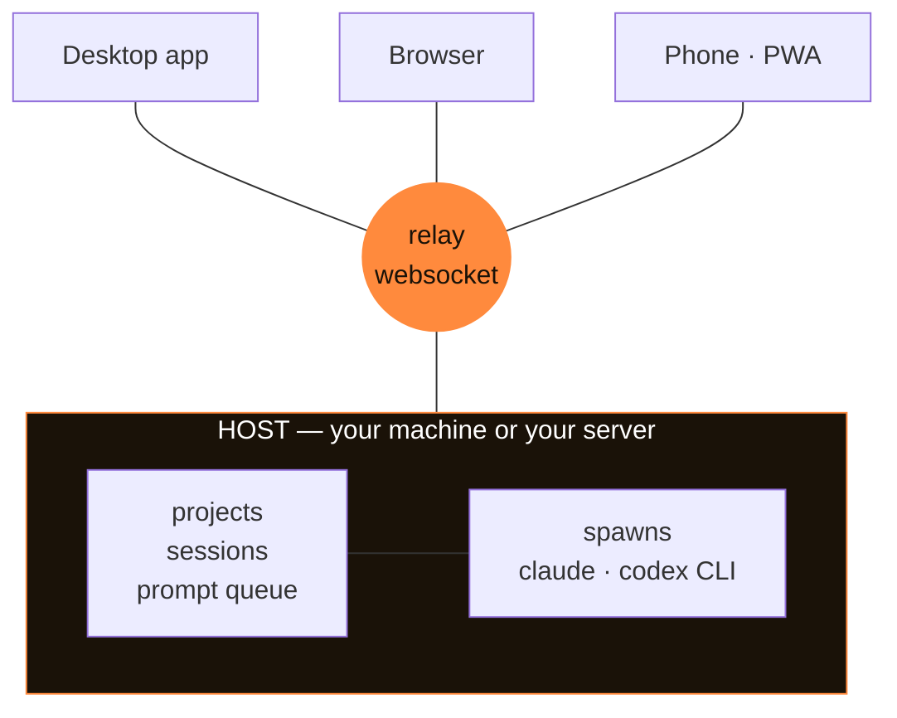

<div align="center">


# Maestrus

### The maestro of your AI coding agents

**One conductor for every codebase you own.**<br/>
Many projects, many accounts, one orchestra — on your machines, with your accounts.

<br/>

[](https://maestrus.cloud/downloads/maestrus-win-0.4.56.exe)
[](https://maestrus.cloud/downloads/maestrus-mac-0.4.56.dmg)
[](#build-from-source)

<sub>Latest release **v0.4.56** · [all versions](https://github.com/joaoventuri/maestrus/releases) · Apache-2.0</sub>

<br/>


</div>

---

## The problem

Claude Code and Codex are superb — at **one project, in one terminal, on one
machine**. The moment you own five codebases, the model breaks down: five
terminals, five contexts in your head, and the work stops the second you close
the laptop.

## The idea

Maestrus is the layer above the agent. Each codebase becomes a *system* it can
drive — a local folder, a GitHub repo, a server over SSH. From one chat you
dispatch work to different projects **in parallel**, like a conductor cueing
every section of an orchestra.

Nothing is proxied. The agent runs on **your** machine under **your**
subscription. There is no service in the request path — including ours.

---

## What you get

<table>
<tr>
<td width="50%" valign="top">

### Parallel projects
Dispatch a task, switch to another project while it works, come back when it is
done. Each keeps its own conversation, model, permissions and memory.

</td>
<td width="50%" valign="top">

### Your account, your tokens
Claude Code CLI on your subscription, Codex CLI on your ChatGPT plan, or a
direct API key. Pick per project.

</td>
</tr>
<tr>
<td width="50%" valign="top">

### Multiple accounts
Hit a usage limit mid-task? Switch accounts **without losing the conversation** —
per project, syncing live across every screen.

</td>
<td width="50%" valign="top">

### Work that survives you
One machine is the **host**. Close the laptop, the turn keeps running. Reopen on
your phone and it is still there.

</td>
</tr>
<tr>
<td width="50%" valign="top">

### Jarvis Mode
Speak, the agent works, the answer comes back spoken. Wake word, realtime voice,
and a conductor orb so you know when it is thinking.

</td>
<td width="50%" valign="top">

### Scheduled routines
Cron jobs per project, in the host's timezone: *"every weekday at 9am, review
yesterday's diff."*

</td>
</tr>
<tr>
<td width="50%" valign="top">

### Powers
MCP servers, skills and slash commands managed from the UI — shared across
projects, compiled for both Claude and Codex.

</td>
<td width="50%" valign="top">

### Any screen
Desktop app, browser client, installable PWA. Same conversations, same host.

</td>
</tr>
</table>

---

## Install

### Desktop

| Platform | Download | Notes |
|---|---|---|
| **Windows** | [`maestrus-win-0.4.56.exe`](https://maestrus.cloud/downloads/maestrus-win-0.4.56.exe) | Installer, auto-updates |
| **macOS** (Apple Silicon) | [`maestrus-mac-0.4.56.dmg`](https://maestrus.cloud/downloads/maestrus-mac-0.4.56.dmg) | Installer, auto-updates |
| **Linux** | [build from source](#build-from-source) | AppImage builds in CI; no published binary yet |

> Node, Git and the Claude CLI ship inside the installer — no setup, no internet
> required at install time.

### Build from source

```bash
git clone https://github.com/joaoventuri/maestrus.git
cd maestrus
npm install

npm run dev            # development, hot reload
npm run build          # installer for the current platform
npm run build:linux    # AppImage
npm test               # unit tests + i18n key check
```

Requires **Node 22+**.

---

## Connect an engine

Maestrus drives agents you already have — it never brokers your login.
Authentication happens between you and the provider, in your terminal; Maestrus
reads the credential the CLI already stored.

| Engine | Uses | Setup |
|---|---|---|
| **Claude** | Claude Code CLI, your subscription | `claude auth login` |
| **Codex** | Codex CLI, your ChatGPT plan | `codex auth login` |
| **Claude API** | Anthropic API key | paste in Settings |
| **Codex API** | OpenAI API key | paste in Settings |

---

## How it works


```mermaid
flowchart TB
    D["Desktop app"] --- R(("relay<br/>websocket"))
    W["Browser"] --- R
    P["Phone · PWA"] --- R
    R --- H

    subgraph H ["HOST — your machine or your server"]
        direction LR
        PR["projects<br/>sessions<br/>prompt queue"] --- AG["spawns<br/>claude · codex CLI"]
    end

    style H fill:#1a1208,stroke:#ff8a3d,color:#fff
    style R fill:#ff8a3d,stroke:#ff8a3d,color:#1a1208
```

The **host** owns the projects, the history and the queue. Clients are views
onto it — which is why closing your laptop does not stop a running turn, and why
a prompt typed on your phone survives a reconnect.

<details>
<summary><b>Repository layout</b></summary>

| Path | Role |
|---|---|
| `electron/` | Main process: IPC, agent spawn, prompt queue, SSH, host mode |
| `renderer/` | React UI — desktop, web and mobile share it |
| `relay/` | WebSocket broker so clients reach the host |
| `selfhost/` | Docker Compose stack for self-hosting |
| `maestrus-server/` | Headless orchestrator for containers |
| `scripts/` | Build helpers, runtime bundling |

</details>

---

## Run your own server

Prefer the host to be a server instead of your desktop? The self-hosted stack
runs the orchestrator 24/7 and serves the web app and the PWA from one port.

```bash
cd selfhost
cp .env.example .env       # set a strong SELFHOST_SECRET
docker compose up -d
```

Open `http://your-server:8090`, or point the desktop app at it with
**Connect to my server** (URL + secret). Full guide in
[`selfhost/README.md`](selfhost/README.md).

**Nothing calls home.** No license check, no telemetry, no account.

---

## What people build with it

- **A team's shared brain** — one server hosts every repo; the whole team
  dispatches from laptops and phones.
- **Overnight work** — scheduled routines review diffs, triage issues and open
  PRs while nobody is awake.
- **Hands-free ops** — voice mode on a phone, driving a build on a server.
- **A private agent** — self-hosted, air-gapped from any vendor but the model
  provider you chose.

---

## Contributing

Issues and PRs welcome — see [CONTRIBUTING.md](CONTRIBUTING.md).
Please read [SECURITY.md](SECURITY.md) before deploying: the agent runs with
real permissions, and the choice of host machine matters.

## License

[Apache License 2.0](LICENSE).

Maestrus orchestrates third-party agents; it does not include them. The Claude
Code CLI and the Codex CLI are distributed by their vendors under their own
terms, and your use of them is governed by your agreement with those vendors.

<div align="center">
<br/>
<sub>Built for people who own more than one codebase.</sub>
</div>
